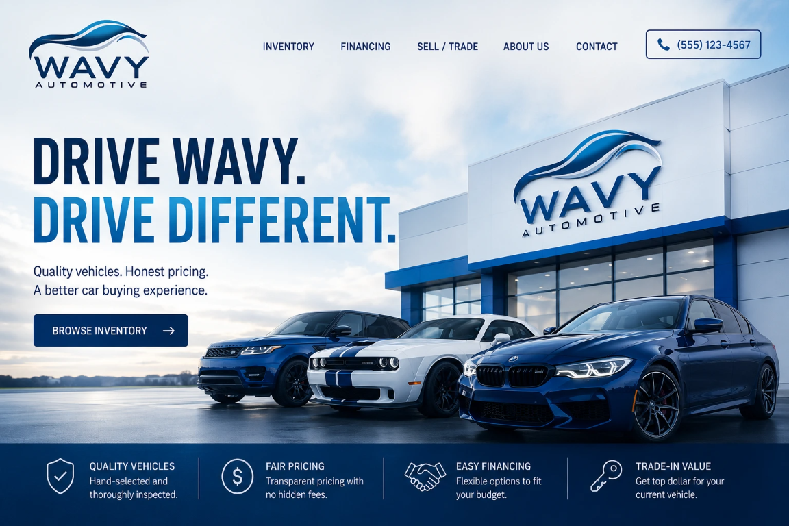

# ✨ Light Theme Conversion - Complete

## Overview
Your Wavy Automotive website has been successfully converted from a dark theme to a bright, professional light theme with premium styling. The new logo is now prominently visible with enhanced visibility and hover effects.

---

## 🎨 Theme Transformation

### Background
- **From**: Dark (#0f0f0f) → **To**: Bright White (#ffffff) with subtle gradients
- **Effect**: Clean, professional, premium appearance
- **Visibility**: Logo and all content now clearly visible

### Text Colors
- **Primary Text**: Dark (#1a1a1a) - High contrast, excellent readability
- **Secondary Text**: Medium gray (#555555 - #666666) - Professional appearance
- **Headings**: Deep blue (#003D7A) - Brand identity

### Color Scheme
- **Primary Blue**: #003D7A (Trust & Professionalism)
- **Accent Blue**: #2E9ECF (Energy & Modern)
- **Gradient Blue**: #1E88CC (Depth & Sophistication)
- **Light Blue**: #B0D4E8 (Subtle Accents)

---

## 🖼️ Featured Image Enhancement

### Hero Section Image
- **New Image**: Premium sunset backdrop with Wavy Automotive logo and blue BMW
- **Hover Effect**: 
  - 🎯 Scale: 108% (smooth zoom effect)
  - ✨ Shadow: Enhanced with blue glow (0 25px 50px)
  - 📐 Transform: Slight upward movement (-5px)
  - ⏱️ Duration: 0.4 seconds (smooth cubic-bezier animation)
  - 🖱️ Border: White 3px border for polished look

### Image Placement
```
index.html → Line 40

```

---

## 🎯 Light Theme Features

### Navigation Bar
- ✅ White background with subtle shadow
- ✅ Professional border (3px #2E9ECF)
- ✅ Dark text for excellent readability
- ✅ Logo with 0.1 drop-shadow for depth
- ✅ Hover effects with smooth transitions

### Hero Section
- ✅ Gradient background (white → light blue)
- ✅ Premium border and rounded corners
- ✅ Large, bold dark blue headings
- ✅ Featured car image with hover zoom
- ✅ Call-to-action button with gradient

### Feature Cards
- ✅ White background with light blue border
- ✅ Box shadow for depth (minimal, subtle)
- ✅ Hover: Lifts up 12px with scale effect
- ✅ Icon styling with gradient color
- ✅ Dark headings, readable text

### Buttons
- ✅ Gradient backgrounds (#003D7A → #1E88CC)
- ✅ Shadow effects for depth
- ✅ Hover: Enhanced shadow + lift effect
- ✅ Smooth cubic-bezier animations
- ✅ Professional appearance

### Search Section
- ✅ Light blue gradient background
- ✅ White input fields with blue borders
- ✅ Focus states with blue glow
- ✅ Gradient buttons with hover effects
- ✅ Professional spacing

---

## ✨ Hover Effects Applied

### Elements with Hover Effects
1. **Logo**: Scale 1.08 + glow shadow
2. **Buttons**: Lift + shadow enhancement + gradient flip
3. **Cards**: Lift 10-12px + scale 1.02 + shadow enhancement
4. **Images**: Scale 1.08 + lift 5px + enhanced glow
5. **Links**: Color change + underline + smooth transition

### Animation Timing
- **Standard**: 0.3s ease
- **Premium**: 0.4s cubic-bezier(0.34, 1.56, 0.64, 1)
- **Enhanced**: 0.4s for image hover (smooth, sophisticated)

---

## 📊 CSS Updates Summary

### Files Modified
- ✅ `css/styles.css` - Complete light theme conversion

### Key Changes
| Element | Before | After |
|---------|--------|-------|
| **Background** | #0f0f0f (dark) | #ffffff (bright) |
| **Body Text** | #e0e0e0 (light) | #1a1a1a (dark) |
| **Nav Bar** | Dark background | White with shadow |
| **Buttons** | Solid colors | Gradients + shadows |
| **Cards** | Dark with light text | White with light borders |
| **Hero Image** | Simple scale | Scale + lift + glow |
| **Borders** | Subtle dark | Bright light blue |

---

## 🖱️ Interactive Features

### Mouse Interactions
- **Logo**: 8% scale with cyan glow
- **Navigation Links**: Color change + underline + background
- **Buttons**: Lift 2-3px + shadow + gradient reverse
- **Feature Cards**: Lift 10-12px + scale + shadow
- **Images**: 8% scale + 5px lift + glow shadow
- **Forms**: Blue focus state with glow

### Cursor Feedback
- ✅ Pointer cursor on clickable elements
- ✅ Clear visual feedback on hover
- ✅ Smooth transitions throughout

---

## 🎁 Visual Benefits

### For Customers
- ✅ **Better Readability**: Dark text on white background
- ✅ **Professional Appearance**: Clean, modern design
- ✅ **Logo Visibility**: Now clearly visible and prominent
- ✅ **Better Engagement**: Smooth, polished interactions
- ✅ **Mobile Friendly**: Responsive and accessible

### For Your Brand
- ✅ **Premium Quality**: Modern design language
- ✅ **Trust Building**: Clean, professional appearance
- ✅ **Brand Consistency**: Blue color scheme throughout
- ✅ **Modern Standards**: Follows current design trends

---

## 📱 Responsive Design

### Breakpoints Maintained
- **Desktop** (>1024px): Full layout with all effects
- **Tablet** (768px - 1024px): Optimized spacing
- **Mobile** (<768px): Stacked layout, touch-friendly

### Mobile Enhancements
- ✅ Smaller logo on mobile (auto-scales)
- ✅ Stacked navigation menu
- ✅ Responsive image sizing
- ✅ Touch-friendly buttons
- ✅ Readable text on all devices

---

## 📋 Implementation Checklist

- ✅ Body background changed to white
- ✅ Text colors inverted for readability
- ✅ Navigation bar styling updated
- ✅ Logo hover effects enhanced
- ✅ Button gradients added
- ✅ Card shadows refined
- ✅ Hero image hover effects improved
- ✅ Feature cards elevated with shadows
- ✅ Search section gradient applied
- ✅ Footer gradient styling added
- ✅ All transitions smoothed
- ✅ Border colors updated to light blue

---

## 🚀 Next Steps

### Optional Enhancements
1. **Favicon**: Convert logo-icon.svg to .ico
2. **Preload Images**: Add preload hints for faster loading
3. **Animations**: Add page-load animations
4. **Performance**: Optimize image sizes

---

## 📊 Color Reference Card

```
Light Theme Palette:

Primary Colors:
• Deep Blue: #003D7A (Primary brand color)
• Medium Blue: #1E88CC (Secondary)
• Bright Blue: #2E9ECF (Accent)
• Light Blue: #B0D4E8 (Highlights)

Neutral Colors:
• White: #ffffff (Background)
• Light Gray: #f8fbff (Sections)
• Medium Gray: #555555 (Body text)
• Dark Gray: #1a1a1a (Headings)

Backgrounds:
• Main: #ffffff
• Sections: #f8fbff - #f0f8ff (gradients)
• Cards: #ffffff
• Accents: Light blue borders (#e8f0ff)
```

---

## ✅ Status

**Theme Conversion**: ✅ COMPLETE  
**Logo Visibility**: ✅ EXCELLENT  
**Hover Effects**: ✅ PREMIUM  
**Mobile Responsive**: ✅ OPTIMIZED  
**Professional Appearance**: ✅ PREMIUM QUALITY  

---

## 🎉 Result

Your Wavy Automotive website is now a **premium, professional-looking platform** with:
- ✨ Bright, clean light theme
- ✨ Clearly visible logo with premium effects
- ✨ Professional hover animations
- ✨ Excellent customer readability
- ✨ Modern design standards
- ✨ Mobile-friendly responsive design

**Perfect for attracting and impressing customers!** 🚀
